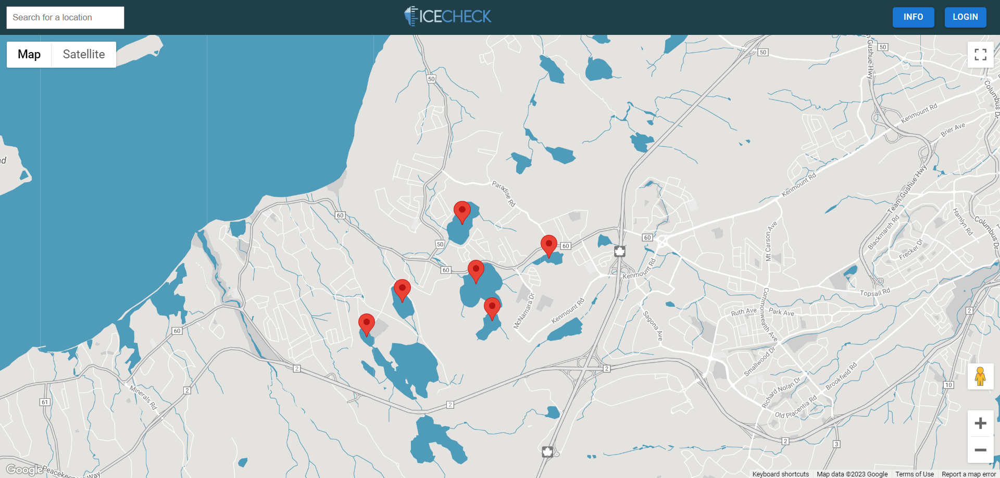

## IceCheck

---

### **Description**

Do you venture onto frozen ponds and lakes during the winter? IceCheck will keep you up to date on current ice levels, and to give you a platform to contribute valuable updates for fellow outdoor enthusiasts!

Here are some key features to get you started:
* Discover nearby ponds/lakes and explore recent updates of ice thickness. To view current updates, click on the red markers displayed on the map. Here you also have the option to create your own posts.
* If a pond or lake doesn't have any current updates, but you would like to make one, you can search for the desired location in the top left corner, and this will give you the option to make a post.

---

### **Motivation**

When I was growing up, I would often go ice skating during the winter. Me and my friends were always eager to get out on the ponds, but it was always hard to know if they were frozen enough. Thinking of this issue later in life, I realized that there was still no real resource you could use to find information about current ice levels on ponds in the winter, apart from word of mouth. 

---

**Built With**

- [Create React App](https://reactjs.org/docs/create-a-new-react-app.html)
- [React.js](https://reactjs.org/)

---

#### **Getting Started**

Click this link: [IceCheck](https://btremb.github.io/IceCheck/)

Or:

Clone this repository and run

    Ensure you're in the root file of the project

    cd IceCheck
    npm install

Once the `node_modules` are installed, run

    npm start

_**Please Note:** This app is still in development, and currently only works off of local storage

---

